# ☁️ Desafio DIO - Gerenciamento de instâncias EC2 na AWS

Este é um repositório criado para documentação de aprendizados e para futuras consultas em caso de uso em projetos.

Irei compartilhar o que aprendi e entendi do conteúdo por meio de explicações resumidas e algumas das fotos de anotações feitas ao longo das aulas, contendo explicação de conceitos, exemplos dados e ilustrações tanto mostradas em aula quanto criadas para melhor compreendimento.

---

## 📋 Tópicos a serem compartilhados:

- 🖥️[Definição de EC2](https://github.com/HeynanCharles/desafio-dio-repositorio-de-estudos-EC2/tree/main#%EF%B8%8F-defini%C3%A7%C3%A3o-de-ec2)
- 📝 [Tipos de instância](https://github.com/HeynanCharles/desafio-dio-repositorio-de-estudos-EC2/tree/main#-tipos-de-instância)
- 💲 [Cálculo de custos](https://github.com/HeynanCharles/desafio-dio-repositorio-de-estudos-EC2/tree/main#-cálculo-de-custos)
  - AWS Pricing Calculator
  - Convention name
  - Opções de pagamento
- 📊 [Otimização de recursos](https://github.com/HeynanCharles/desafio-dio-repositorio-de-estudos-EC2/tree/main#-otimização-de-recursos)
- 📈 [Escalação de recursos](https://github.com/HeynanCharles/desafio-dio-repositorio-de-estudos-EC2/tree/main#-escala%C3%A7%C3%A3o-de-recursos)
- ☁️ [Armazenamento em nuvem](https://github.com/HeynanCharles/desafio-dio-repositorio-de-estudos-EC2/tree/main#%EF%B8%8F-armazenamento-em-nuvem)
  - EBS
  - S3
- 📝 [Tipos de classe de armazenamento](https://github.com/HeynanCharles/desafio-dio-repositorio-de-estudos-EC2/tree/main#-tipos-de-classe-de-armazenamento)
- 🔄 [Frequência de acesso](https://github.com/HeynanCharles/desafio-dio-repositorio-de-estudos-EC2/tree/main#-frequência-de-acesso)
  - Lifecycle
- 💿 [AMI](https://github.com/HeynanCharles/desafio-dio-repositorio-de-estudos-EC2/tree/main#-ami---amazon-machine-image)
- 💾 [Snapshot EBS](https://github.com/HeynanCharles/desafio-dio-repositorio-de-estudos-EC2/tree/main#-snapshot-ebs)
- 🔎 [Comparação AMI e Snapshot](https://github.com/HeynanCharles/desafio-dio-repositorio-de-estudos-EC2/tree/main#-compara%C3%A7%C3%A3o-ami-e-snapshot)
- 🖌 [Desenhos de arquitetura de software](https://github.com/HeynanCharles/desafio-dio-repositorio-de-estudos-EC2/tree/main#-desenhos-de-arquitetura-de-software)

---

## 🖥️ Definição de EC2

Elastic Compute Cloud são máquinas virtuais, pendo ter como sistema operacional o Windows ou o Linux

- Com ela pode ser definido segurança básica utilizando firewall incorporada ao AWS, utilizar grupo de segurança, protocolo, porta, IPs de origem, permite e nega o acesso às suas instâncias EC2;

- Quando criamos um EC2 estamos utilizando o tipo **Infraestrutura como Serviço**, nesse caso, sendo um IAAS (Infrastructure as a service)
  - Nossa responsabilidade seria a dos aplicativos, dados e conexões que fazemos.

A EC2 é composta por:
- CPU
- Rede
- Memória
- Disco
- Sistema operacional

---

## 📝 Tipos de instância

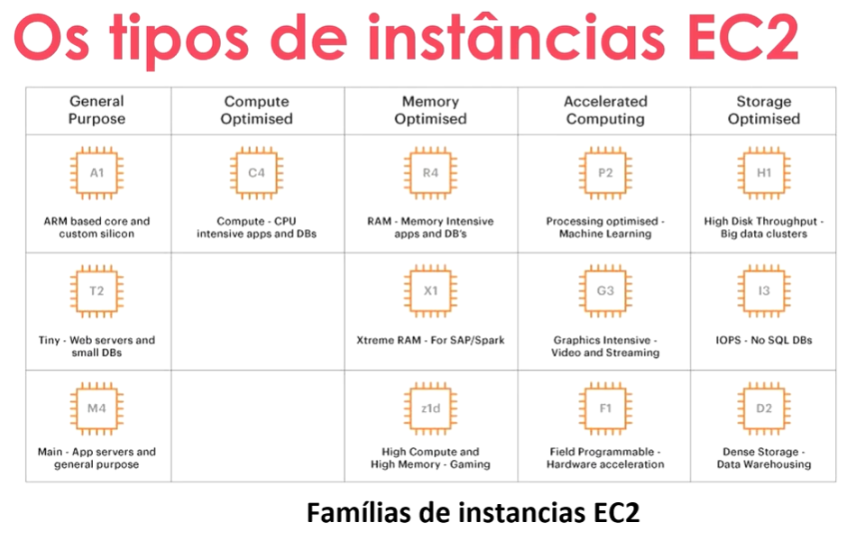

- A T2 é uma das mais utilizadas, por ser ideal para servidores e banco de dados pequenos

---

## 💲 Cálculo de custos

### AWS Pricing Calculator

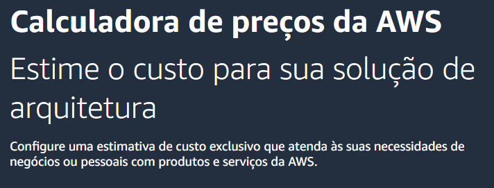

Com o AWS Pricing Calculator, você pode calcular o valor de uma instância, personalizando **máquina**(vCPUs, RAM, GB), **instâncias de cidades**, **instâncias compartilhadas**, **hosts dedicados** e até **carga de trabalho** da instância.

- Pode ser feito reservas de instância, compra de instância sob demanda, entre outros.

### Convention name

O Convention name é a descrição da máquina, como se fosse uma sigla, mas que descreve exatamente que máquina é aquela e um resumo de sua potência.

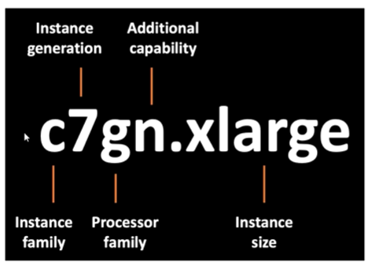

### Opções de pagamento

- **Instâncias reservadas** - Costumam ser mais baratas qye a sob demanda, mas por outro lado deve ser paga anualmente, ao contrário da sob demanda. Se a instância não for muito usada, essa opção não é viável.

- **Sob demanda** - Instâncias compradas a uma taxa fixa por hora, sendo recomendada para aplicativos com cargas de trabalho irregulares de curto prazo que não podem ser interrompidas.

- **Instância spot** - Garante a disponibilidade das aplicações sob demanda com descontos de até 90%, mas elas podem ser encerradas a qualquer momento pela AWS, com aviso de dois minutos. Nesse caso, essa forma de pagamento é recomendada para aplicações que suportem falhas e interrupções sem ser prejudicada.

---

## 📊 Otimização de recursos

Quando falamos de otimização de recurso, estamos nos referindo à custo, diminuição de custo ou otimização de uso, que também diminui custo, entre outras opções, irei citar algumas:

- Fazer o uso de uma EC2 adequada para aquela tarefa, pagando exatamente pelo o que será usado, e se necessário, fazer upgrade para atender à nova situação

- Desligar recursos quando não forem utilizados, diminuindo os gastos em momento não necessários. Para otimizar ainda mais esse ponto, pode ser feita uma automação, para que em fins de semana ou feriados, o próprio código criado desligue o recurso, assim evitando esquecer de desligar ou algo do tipo;

- A remoção de recursos ociosos ou não utilizados é uma prática muito boa também, pois pode ocorrer de haver recursos pouco usados que são esquecidos e continuam gerando cobrança, nesse caso o adequado e fazer o **stop** e o **deallocated**, fazendo com que a instância fique livre e pare de gerar cobrança.

---

## 📈 Escalação de recursos

É um processo executado em momento específicos para processamento de workload, podendo ser feito automaticamente ou de forma manual, de acordo com a necessidade. Há duas formas de escalação, sendo elas horizontal ou vertical:

### Escalação vertical

Nessa escalação você acrescenta ou reduz a capacidade de um recurso, geralmente relacionado ao poder da máquina, como vCPUs, memória, storage rede de uma instância, etc..., ou seja, subindo o nível de processamento ou descendo, como uma escada.

### Escalação horizontal

Segue a mesma premissa da escalação vertical, mas agora se tratando de aumento de recurso, por exemplo, se uma máquina atingir uma porcentagem X de processamento, ela irá criar outra igual, para que a aplicação continue rodando.

Basicamente, a **escalação vertical** é voltada para o aumento de processamento de uma máquina, que pode ser acrescentado ou diminuído de acordo com a necessidade, já a **escalação horizontal**, é voltada para a criação de uma máquina igual a uma já existente, apenas para que a aplicação possa continuar rodando.

---

## ☁️ Armazenamento em nuvem

### EBS - Elastic Block Store

o Amazon EBS é um storage altamente confiável  que pode ser anexado em qualquer instância EC2, possibilitando capacidade de extensão de forma rápida. Nós conseguimos criar uma nova partição na EC2, sendo como anexar um HD Externo.

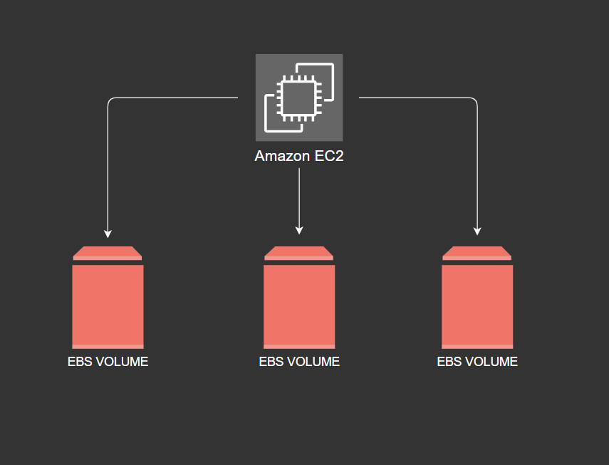

#### **Exemplos de uso:**

- Armazenamento para bando de dados, como MySQL, PostgreSQL e Oracle

- Armazenar dados para aplicativos webs e log de sistemas.

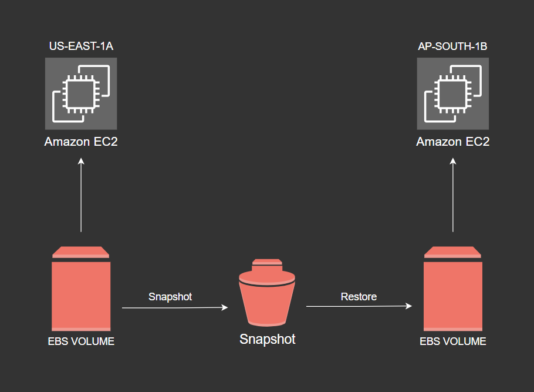

### S3 - Amazon Simple Storage Service

O S3 (Amazon Simple Storage Service) é um serviço de armazenamento voltado para objetos, sendo ideal para armazenar, organizar e recuperar grandes volumes de dados de forma segura e escalável.

- Possui classes de storages, possibilitando economizar nos custos

- O S3 permite guardar dados e arquivos sem custo, mas para ler os mesmos, há uma cobrança.

#### Exemplo de cobrança:

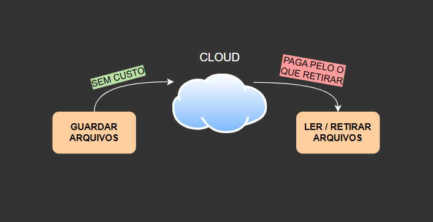

---

## 📝 Tipos de classe de armazenamento

---

## 🔄 Frequência de acesso

Junto à isso, temos uma linha que mostra a frequência de acesso das classes mostradas acima:

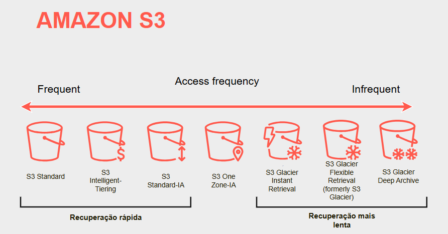

### Lifecycle

Existe também a regra do clico de vida, que é uma organização de gestão de objetos visando a economia de lucros, onde dados que vão ser acessados frequentemente à 90 dias, são armazenados em serviços específicos, já se forem acessados em intervalos maiores, vão para o Glacier.

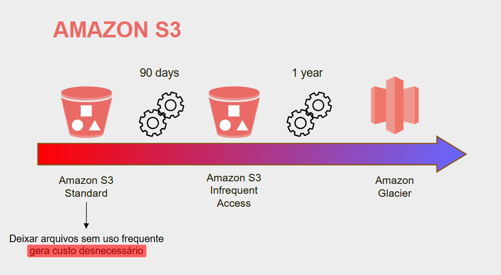

---

## 💿 AMI - Amazon Machine Image

 É uma forma de duplicar uma EC2, sem ser do zero, sendo basicamente um copia e cola. Em oposto à própria EC2, não tem que ser feito nenhum processo para trabalhar com a AMI, você consegue criar com as instâncias em execução ou paradas, o que facilita e agiliza o gerenciamento e criação delas. Mais alguns pontos sobre a AMI:

 - Você pode escolher entre usar uma AMI pública, disponibilizada pela AWS, ou pode optar por criar uma AMI privada, tendo a opção de personalizá-la do jeito que for necessário

 - Como dito antes, com a AMI pode ser feita uma replicação de instâncias de forma rápida, é só criar uma EC2 e a partir dela criar a sua AMI;

 - E por último, mas não menos importante, vale lembrar que possuem vários tipos de AMI, incluindo AWS, Linux, Windows e outros. É importante saber que a AMI deve ser idêntico ao sistema, ou seja, usar o mesmo sistema operacional.

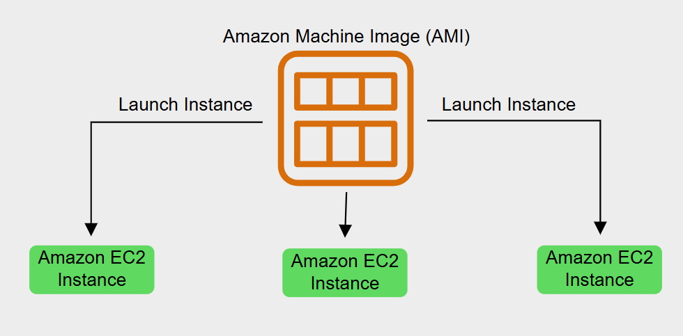

---

## 💾 Snapshot EBS

 Snapshot EBS é um serviço de backup nativo do AWS, que faz backup dos volumes EBS em um determinado momento, sendo possível configurar essa frequência em que os snapshots são tirados.

### Informações sobre custos

 - Possuem custos diferentes de acordo com a região
   - Leste EUA - **US$0,05 por GB/mês**
   - Região UE (Londres) - **US$0,053 por GB/mês**

---

## 🔎 Comparação AMI e Snapshot

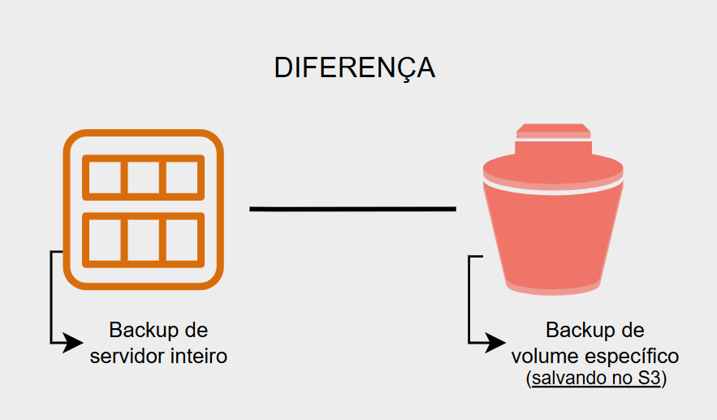

---

## 🖌 Desenhos de arquitetura de software

### EC2 com EBS

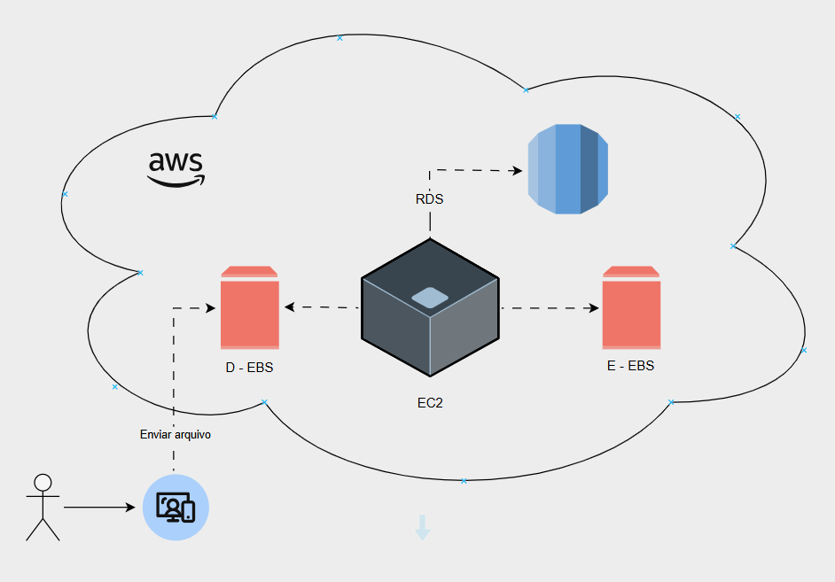

### S3 com Lambda

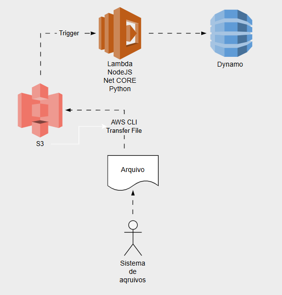
